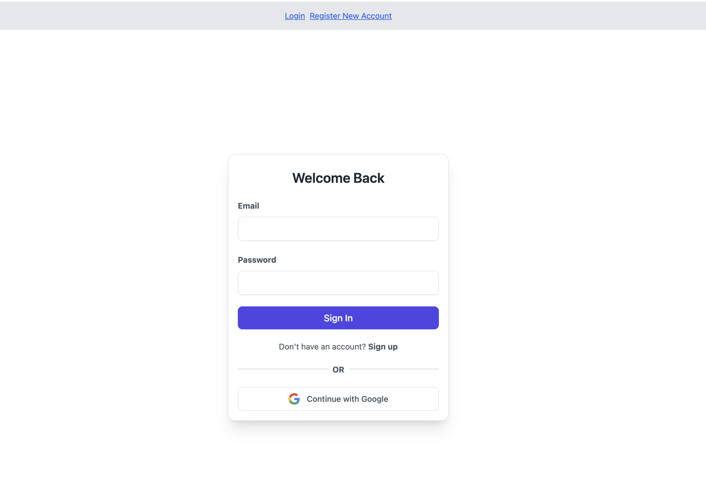

<h1 align="center">
  <br>
  Firebase Login
  <br>
</h1>

<h4 align="center">Basic firebase authentication login.</h4>




## How To Use

To clone and run this application, you'll need [Git](https://git-scm.com) and [Node.js](https://nodejs.org/en/download/) (which comes with [npm](http://npmjs.com)) installed on your computer. From your command line:

```bash
# Install dependencies
$ npm install

# Run the app
$ npm start
```
